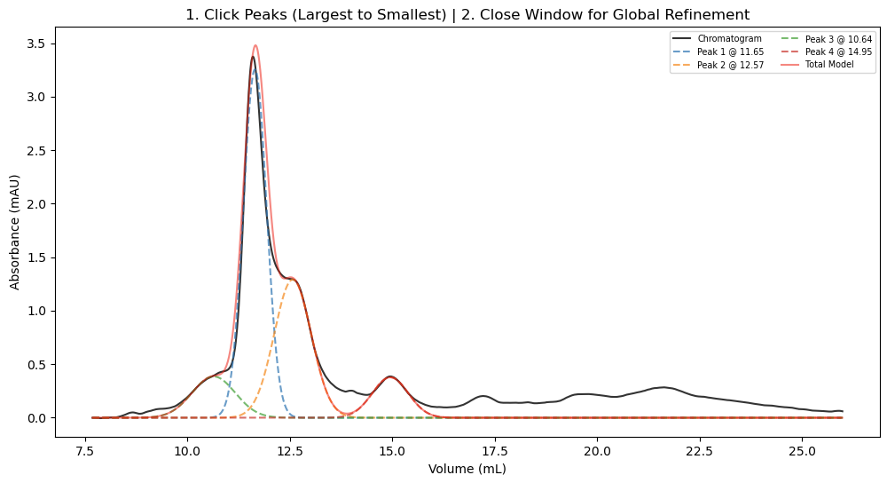
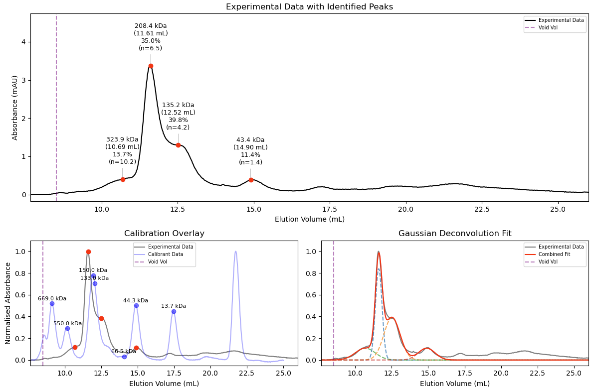

# Analytical SEC Gaussian Fitting and Molecular Weight Estimation

## Overview

This package provides a workflow for fitting Gaussian peaks to analytical size-exclusion chromatography (SEC) traces and estimating molecular weights based on calibration standards.

The software was designed for analytical SEC experiments performed on:
-   Superdex 200 Increase 10/300 GL columns (and others configurable via `columns.py`)
-   ÄKTA Go
-   ÄKTA Purifier

The program fits Gaussian peaks to chromatographic data and calculates molecular weights using:
1. The fitted Gaussian midpoints (elution volumes)
2. A column calibration curve derived from known protein standards

---

## Features

-   **Broad Compatibility:** Robustly auto-detects headers, encodings, and injection volumes from messy ÄKTA CSV exports.
-   **Configurable Columns:** Easily switch between different SEC columns and calibration profiles via a centralized `columns.py` dictionary.
-   **Interactive Fitting:** Click directly on your chromatogram to fit Gaussian models to specific peaks or shoulders.
-   **Molecular Weight Estimation:** Automatically maps fitted peak elution volumes to a standard curve.
-   **Advanced Deconvolution (`main_auto.py`):** Resolve complex, overlapping peaks with restricted global optimization, area-under-the-curve (AUC) relative abundance, and stoichiometry estimation.

---

## Installation

Clone the repository and install the required dependencies:

    git clone https://github.com/james-r-barrett/SEC_Fit
    cd SEC_Fit
    pip install -r requirements.txt

---

## Usage

This repository contains two main analytical scripts depending on your needs. Both are executed via the command line:

    python <script_name>.py trace.csv

Where `trace.csv` is the chromatogram exported from the ÄKTA system.

### Option 1: Standard Analysis (`main.py`)
Best for quick, single-peak analysis or well-separated species.

1.  **Initialization:** The script reads the CSV, auto-detects the injection volumes, and prompts you to select the appropriate column and injection run.
2.  **Interactive Selection:** A plot opens showing your baseline-corrected chromatogram. Click the apex of any peaks you wish to fit. The script will fit and display individual Gaussian curves instantly. Close the window when finished.
3.  **Results:** A single unified plot displays your data, the Gaussian fits, text annotations for the calculated mass, and an overlay of the calibration chromatogram.
4.  **Export:** Automatically saves a basic `_processed_plot.csv` containing the full elution volume and baseline-corrected absorbance for external plotting.

### Option 2: Advanced Deconvolution (`main_auto.py`)
Best for overlapping peaks, quantifying relative abundance, or estimating oligomeric states.

1.  **Initialization:** Select your column and injection run as usual. 
2.  **Stoichiometry (Optional):** Enter the expected molecular weight of your monomer (in kDa) to calculate oligomeric states ($n$), or press Enter to skip.
3.  **Interactive Selection:** Click the peaks you want to fit.
4.  **Global Refinement:** Upon closing the window, the script applies a restricted global optimization algorithm to fit all selected Gaussians *simultaneously*, properly deconvoluting overlapping areas.
5.  **Results:** Generates a publication-style 3-panel figure showing the raw data with text annotations (Mass, Volume, Relative Abundance %, and Stoichiometry), a normalized calibration overlay, and the isolated Gaussian models.
6.  **Export:** Saves an advanced `_processed_plot.csv` containing the raw data, baseline-corrected data, the combined additive fit, and the isolated curves for every individual modeled peak.

---

### Example Output
**Interactive Peak Selection:**

**Final Deconvoluted Output (`main_auto.py`):**

---

## Calibration Information

The repository includes a `calibration.csv` file generated from a calibration run using the Sigma Aldrich Gel Filtration Calibration Kit (Product: 69385).

### Example Column Used
Superdex 200 Increase 10/300 GL

### Calibration Standards
-   Thyroglobulin (670 kDa)
-   Gamma-globulins (150 kDa)
-   Ovalbumin (44.3 kDa)
-   Ribonuclease A Type I-A (13.7 kDa)
-   pABA (0.137 kDa)

Void volume was determined using Blue Dextran 2000. *Note: Different columns and calibration standards can be easily added to `columns.py`.*

---

## Supported Input Data

The program is designed for `.csv` or `.asc` exports from:
-   ÄKTA Go
-   ÄKTA Purifier

Expected contents include:
-   Elution volume (mL)
-   Absorbance (mAU)
-   Injection markers

---

## Assumptions and Limitations

-   Calibration is specific to the included column and standards.
-   Molecular weights are estimates based on SEC behaviour (hydrodynamic radius).
-   Non-globular or intrinsically disordered proteins may deviate significantly from the calibration curve.
-   Accurate baseline subtraction improves fitting results.
-   Gaussian models assume approximately symmetric peaks; extreme tailing or secondary interactions with the resin may affect fit quality.