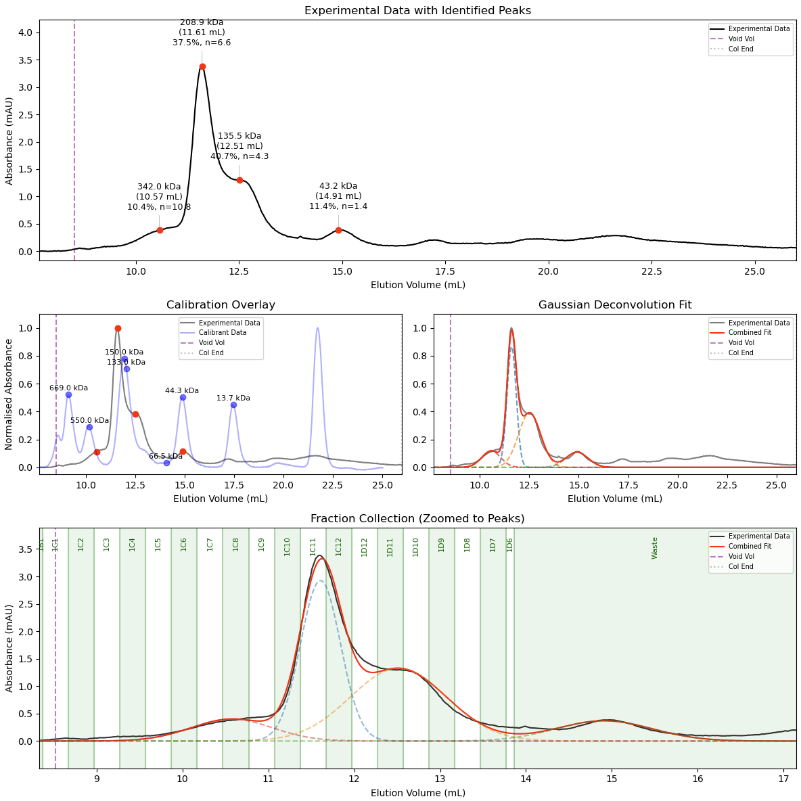

# Analytical SEC Gaussian Fitting and Molecular Weight Estimation

## Overview

This package provides a workflow for fitting Gaussian peaks to analytical size-exclusion chromatography (SEC) traces and estimating molecular weights based on calibration standards.

The software was designed for analytical SEC experiments performed on:
-   Superdex 200 Increase 10/300 GL columns (and others configurable via `columns.py`)
-   ÄKTA Go
-   ÄKTA Purifier

The program fits Gaussian peaks to chromatographic data and calculates molecular weights using:
1. The fitted Gaussian midpoints (elution volumes)
2. A column calibration curve derived from known protein standards

---

## Features

-   **Broad Compatibility:** Robustly auto-detects headers, encodings, and injection volumes from messy ÄKTA CSV exports.
-   **Configurable Columns:** Easily switch between different SEC columns and calibration profiles via a centralized `columns.py` dictionary.
-   **Robust Baseline Correction:** Choose between percentile-ends, rolling-minimum, or flat-end baseline estimation methods.
-   **Interactive Fitting:** Click directly on your chromatogram to fit Gaussian models to specific peaks or shoulders (with undo support).
-   **Global Deconvolution:** Resolve complex, overlapping peaks with restricted global optimization, area-under-the-curve (AUC) relative abundance, and stoichiometry estimation.
-   **Molecular Weight Estimation:** Automatically maps fitted peak elution volumes to a standard curve.
-   **Fraction Collection Mapping:** Automatically extracts fraction volumes and names, overlaying them onto a dedicated, dynamically zoomed subplot to pinpoint exactly where your target species eluted.

---

## Installation

Clone the repository and install the required dependencies:

    git clone https://github.com/james-r-barrett/SEC_fit
    cd SEC_fit
    pip install -r requirements.txt

---

## Usage

Run the analysis script from the command line, pointing it at a chromatogram exported from your ÄKTA system:

    python main_auto.py trace.csv

Optionally, choose a baseline correction method (default is `percentile_ends`):

    python main_auto.py trace.csv --baseline rolling_minimum

1.  **Initialization:** Select your column and injection run.
2.  **Stoichiometry (Optional):** Enter the expected molecular weight of your monomer (in kDa) to calculate oligomeric states (n), or press Enter to skip.
3.  **Fraction Mapping (Optional):** If fraction data is detected in your CSV, you will be prompted to plot them on an additional zoomed-in panel.
4.  **Interactive Selection:** Left-click to fit a peak, right-click to undo the last fit, press Enter when finished.
5.  **Global Refinement:** Upon finishing, the script applies a restricted global optimization algorithm to fit all selected Gaussians *simultaneously*, properly deconvoluting overlapping areas.
6.  **Results:** Generates a publication-style 3-panel (or 4-panel, with fractions) figure showing the raw data with text annotations (Mass, Volume, Relative Abundance %, and Stoichiometry), a normalized calibration overlay, the isolated Gaussian models, and (optionally) a dynamically zoomed fraction collection overlay.
7.  **Export:** Saves `_processed_plot.csv` (the full baseline-corrected trace), `_peaks_fit.csv` (the analysis-window data with the combined and individual Gaussian fits), and, if selected, `_final_plot.pdf`.

---

### Example Output
**Interactive Peak Selection:**

**Final Deconvoluted Output:**

---

## Calibration Information

The repository includes calibration CSV files generated from calibration runs using the Sigma Aldrich Gel Filtration Calibration Kit (Product: 69385).

### Example Column Used
Superdex 200 Increase 10/300 GL

### Calibration Standards
-   Thyroglobulin (670 kDa)
-   Gamma-globulins (150 kDa)
-   Ovalbumin (44.3 kDa)
-   Ribonuclease A Type I-A (13.7 kDa)
-   pABA (0.137 kDa)

Void volume was determined using Blue Dextran 2000. *Note: Different columns and calibration standards can be easily added to `columns.py`.*

---

## Supported Input Data

The program is designed for `.csv` or `.asc` exports from:
-   ÄKTA Go
-   ÄKTA Purifier

Expected contents include:
-   Elution volume (mL)
-   Absorbance (mAU)
-   Injection markers

---

## Assumptions and Limitations

-   Calibration is specific to the included column and standards.
-   Molecular weights are estimates based on SEC behaviour (hydrodynamic radius).
-   Non-globular or intrinsically disordered proteins may deviate significantly from the calibration curve.
-   Accurate baseline subtraction improves fitting results.
-   Gaussian models assume approximately symmetric peaks; extreme tailing or secondary interactions with the resin may affect fit quality.
